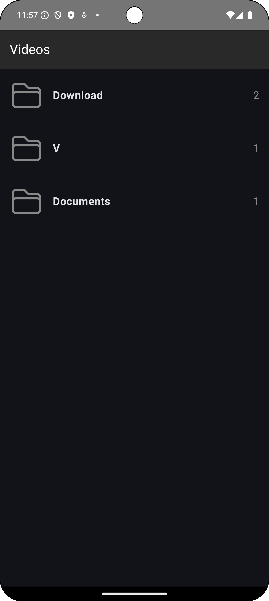
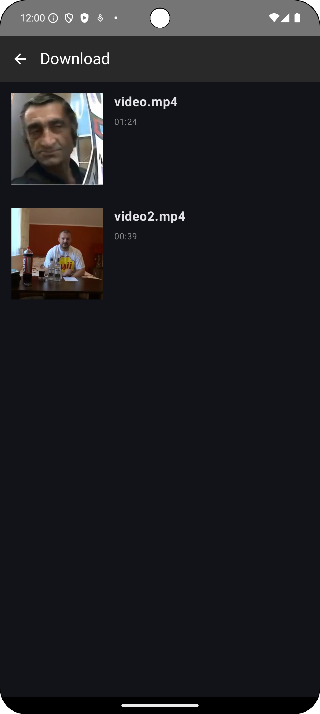
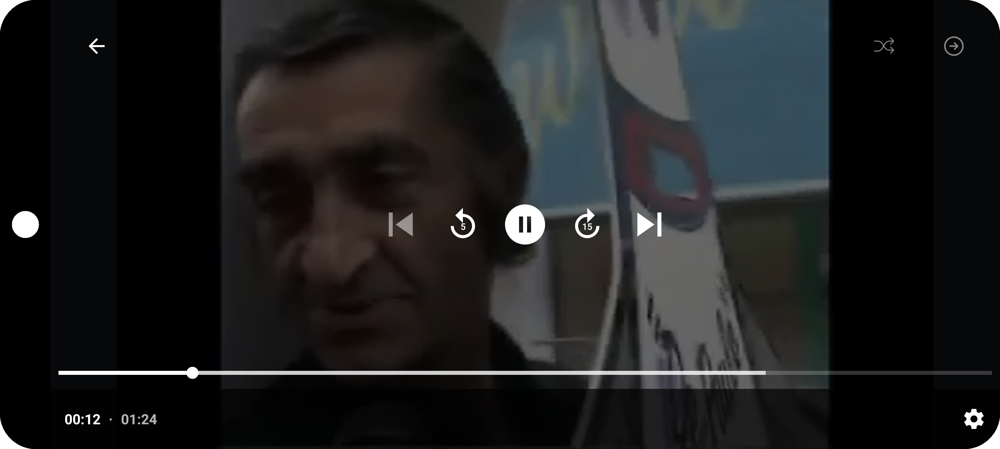

# Video Player App

This project was developed for the Mobile Technologies course. It's an Android application that allows users to browse and play video files stored on their device.

## Features

- Permission handling for accessing device storage
- Folder-based video organization
- Video thumbnail and duration display
- Custom video player with playback controls
- Auto-play and random play options

## Technologies Used

- Kotlin
- Jetpack Compose
- ExoPlayer
- Android Media API

## Installation

1. Clone this repository
2. Open the project in Android Studio
3. Build and run the app on an Android device or emulator

## Usage

1. Launch the app
2. Grant necessary permissions
3. Browse through video folders
4. Select a video to play
5. Use the player controls to manage playback

## Screenshots

Screenshot 1: Folder List

Screenshot 2: Video List

Screenshot 3: Video Player

